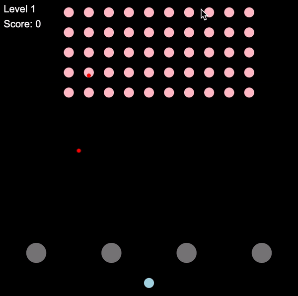

# Space Invaders

Classic retro ‘Space Invaders’ arcade game built with Typescript using Functional Reactive Programming techniques and RxJS observables to handle animation and user interaction. For more details, see [report](https://github.com/lioniewijaya/SpaceInvaders/blob/master/report.pdf).



## How to run
Install dependencies and create production build.
```sh
npm i
npm run build
```
Open spaceinvaders.html in browser.

<br></br>
Developed for FIT2102 Assignment 1.
